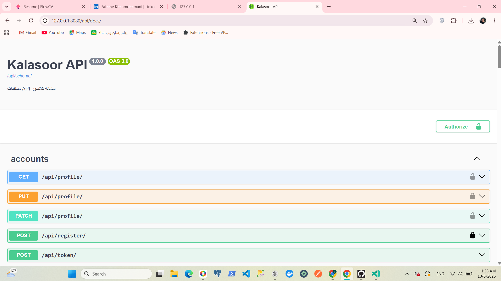

# Kalasoor API 🎓

An API-only backend for an online classroom platform — inspired by Quera — built with Django & Django REST Framework. Supports multi-role classrooms, assignment workflows with rubric-based grading, automated fair group distribution, and a built-in Q&A forum.

---

## ✨ Features

- Role-based access control — Teacher / Student / Mentor permissions enforced at the API level
- Token-based class invitations — secure, single-use invite links for joining classrooms
- Assignment lifecycle — creation, submission, and rubric-based scoring
- Automated group distribution — fair "snake-distribution" algorithm for splitting students into groups
- Q&A Forum — per-classroom discussion threads
- Async notifications — Django signals trigger email notifications on key events (invitations, grading, etc.)
- Fully documented API — interactive Swagger docs + ready-to-use Postman collection

## 🏗️ Project Stats

| Metric | Count |
|---|---|
| REST API endpoints | 77 |
| Database models | 28 |
| Test cases (pytest) | 50 |
| Apps | 5 (Accounts, Assignments, Core, Groups, Forum) |

## 🛠️ Tech Stack

- Framework: Django, Django REST Framework
- Auth: JWT (SimpleJWT)
- Docs: drf-spectacular (Swagger / OpenAPI 3.0)
- Testing: pytest
- API Client: Postman (collection included)

## 🔒 Security Notes

An earlier template-based version of this project had an IDOR vulnerability in profile updates and stored passwords in plaintext during profile edits. Both issues were identified and fixed in this rewrite, alongside a full migration to a secure, API-only architecture.

## 🚀 Getting Started

bash
# Clone the repository
git clone <repo-url>
cd kalasoor

# Create and activate a virtual environment
python -m venv .venv
.venv\Scripts\activate   # Windows
source .venv/bin/activate  # macOS/Linux

# Install dependencies
pip install -r requirements.txt

# Apply migrations
python manage.py migrate

# Run the development server
python manage.py runserver

The API will be available at http://127.0.0.1:8000/.

## 📖 API Documentation

Once the server is running, interactive Swagger docs are available at:

http://127.0.0.1:8000/api/docs/

A ready-to-import Postman collection is also included in (./postman) — just import it into Postman and you're ready to test every endpoint.

## 📂 Apps Overview

| App | Responsibility |
|---|---|
| accounts | User registration, auth, profile management |
| core | Shared utilities and base models |
| groups | Classroom membership & automated group distribution |
| assignments | Assignment creation, submission, rubric grading |
| forum | Classroom Q&A discussions |

## 👩‍💻 Author

Fateme Khanmohammadi
[GitHub](https://github.com/fatemekhanmohammadi/kelasore_platform.git) · [LinkedIn](https://www.linkedin.com/in/fatemekhanmohammadi/)

**Kalasoor** is an educational and final project focused on Backend development with Django and Django REST Framework.

---

⭐